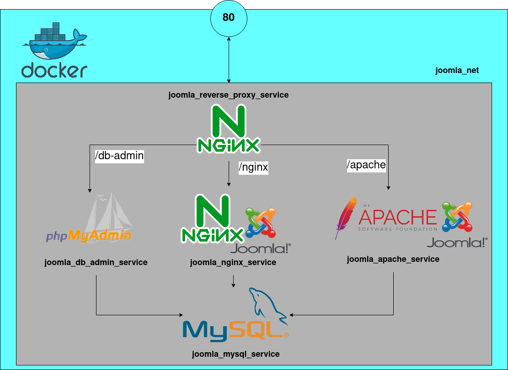

# Joomla + Nginx + Apache + PhpMyAdmin in Docker

This is an example of how you can deploy a Joomla Nginx Apache Service Stack in Docker.

### Architecture

As you can see I am creating from scratch each service, that's because the purpose of this example is to show how these services are built.

If you want to run each necessary command to build this architecture, there's a `start-net.sh` file. Feel free to check it.

If not you can run `docker-compose up` to start it.

### Why am I creating two Joomlas services?

I see that there's a lot of people looking for a good Nginx reverse proxy configuration. In most cases it is in front of (Nginx + Joomla) or (Apache + Joomla) services. This is for them.
